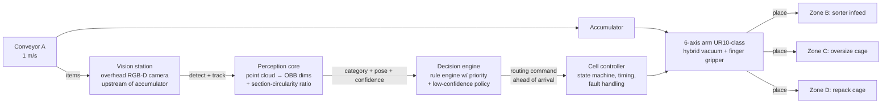

# SortMaster — Intelligent Robotic Product Sorting System

**Ozon Tech Hackathon — Track 3: «Интеллектуальная роботизированная система сортировки товаров»**

A software–hardware complex (ПАК), delivered **entirely in simulation**, that detects a product on the infeed conveyor, classifies it into one of three categories, and physically routes it to the correct processing zone — perception, decision and actuation working as one closed loop.

> **Status: v0 loop closed ✅** — the full physics cell runs end to end: items travel conveyor A at 1 m/s, classify via the rule engine, and a 4-axis palletizer arm routes them to B/C/D. **Routing accuracy 100% on 6/6 random seeds (66 item passes), mean cycle 2.35 s, measured cell capacity ≈ 1000 items/h.** This README is the root navigation document required by the submission rules ("Полнота комплекта сдачи решения", 0–5 pts). Sections marked 🔜 are filled as the roadmap advances. See [ROADMAP.md](ROADMAP.md) for the winning plan and [STEP_BY_STEP.md](STEP_BY_STEP.md) for the execution guide.

---

## 1. The task in one page

Items travel on a feed conveyor (**A**, fixed, belt speed **1 m/s**, belt never stops in the base scenario, max item size 500×500×500 mm) and accumulate in a buffer (накопитель) at its end. The complex must take each item from the accumulator and route it to:

| Zone | Category (official) | Meaning |
|---|---|---|
| **B** — main sorter infeed (fixed conveyor, 500 mm wide, h=700) | «Подходит для сортировки» | Fits the sorter: dims > 10×10×10 mm, fits 450×320×320 mm, **no circular cross-section** |
| **C** — oversize cage (roll-cage 1200×800×800, free placement) | «Не подходит для сортировки по габаритам» | Under- or over-size |
| **D** — repack cage (roll-cage 1200×800×800, free placement) | «Не подходит для сортировки без доупаковки» | Has a **circle in some cross-section** |

**Classification rules (priority order matters and is scored):**
1. **Dimensions gate first:** any dimension ≤ 10 mm (undersize) or exceeding 450×320×320 mm (oversize) → **C**. *An oversized cylinder goes to C, not D.*
2. **Then shape:** circle-in-cross-section, formally `r_inscribed / R_circumscribed ≥ 0.8` for a cross-section → **D**.
3. Otherwise → **B**.

Work zone: 6000×10000 mm; A and B positions fixed, C/D cages and everything else placed by us (see the official layout, [doc-1783009942.pdf](doc-1783009942.pdf)).

**A physical prototype is NOT required.** The rules explicitly accept an engineering solution proven by digital models, simulation and calculations — and the readiness matrix (УГТ) awards its maximum (Executive axis level 4) to a *validated simulation cross-checked against calculations*. That is exactly what we build.

> ✅ **Confirmed by the organizers' experts (Q&A, July 2026):** a physical prototype is not required for the final; the maximum level is "either a strong validated simulation / digital model, or a physical prototype". What matters is depth of engineering, realism, and how convincingly workability is proven. Our roadmap climbs exactly that ladder: working sim (min) → detailed engineering: layout, calculations, 3D models, fault handling (mid) → validated sim cross-checked against calculations (max).

## 2. Architecture (one closed loop, not two components)



Key design decisions (each is defended in the report):

- **Look-ahead classification.** The camera sits upstream: an item is classified *while still travelling* toward the accumulator, so inference latency (~tens of ms) is hidden and the arm receives its command *before* the item arrives — this addresses the scored "Синхронизация по времени" criterion directly.
- **Geometry-first perception.** The official rules are purely geometric, so the primary pipeline measures geometry (depth → point cloud → oriented bounding box dims → cross-section inscribed/circumscribed ratio) and implements the *formal* 0.8 criterion — not a black-box class label. A learned detector (YOLO on synthetic renders) only localizes/tracks items on the belt. This makes borderline behaviour explainable — worth points in three rubric lines.
- **One arm, three zones.** A UR10-class arm at the accumulator with a hybrid gripper (vacuum cup for boxes/flats + adaptive fingers for sacks/cylinders) places items onto B or drops into C/D cages placed inside its reach envelope. Fallback design (kept in the report as an engineering trade-off): tri-directional powered roller table for higher throughput.
- **Safety by design.** Fenced cell, light curtain across the human access side, e-stop chain, reduced-speed service mode — modelled in the layout and described per the "Безопасность эксплуатации" criterion.

## 3. Ground truth for the official test set (computed, reproducible)

We analysed the 11 official STL models with the reference classifier ([tools/classify_mesh.py](tools/classify_mesh.py)). Dimensions are oriented-bounding-box extents; ratio is max over cross-sections along principal axes of `r_in/R_circ`:

| Item | OBB dims, mm | max r_in/R | Verdict | Why |
|---|---|---|---|---|
| Короб 300×200×200 (box) | 301×200×200 | 0.72 | **B** | fits, square section 0.72 < 0.8 |
| ЛанчБокс (lunchbox) | 201×152×62 | 0.66 | **B** | fits, rectangular |
| Моющее средство (detergent) | 280×260×179 | 0.73 | **B** | oval but below 0.8 — near-borderline |
| Короб 400×400×300 (box) | 401×400×300 | 0.72 | **C** | 400 > 320 → oversize |
| Пуфик (pouf) | 489×489×264 | ≈1.0 | **C** | circular **but oversize — priority rule** |
| Ручка (pen) | 148×13×**9** | ≈1.0 | **C** | 9 mm < 10 mm → undersize — priority rule |
| Бутылка (bottle) | 305×91×91 | 0.997 | **D** | circular section |
| Тарелка (plate) | 209×209×27 | 0.999 | **D** | circular |
| Шлем (helmet) | 352×298×282 | 0.89 | **D** | dome sections circular |
| Мешок (sack) | 202×176×170 | 0.886 | **D** | rounded blob (borderline; see note) |
| Цилиндр («cylinder») | 435×50×43 | **0.867** | **D** | actually a **hexagonal prism**: cos 30° = 0.866 ≥ 0.8, and 435 mm is just under the 450 limit — a designed double-borderline trap |

Machine-readable: [docs/ground_truth/item_ground_truth.json](docs/ground_truth/item_ground_truth.json).

**Documented interpretation choices** (flagged for organizer Q&A, analysed in the report's borderline-cases section):
- *Undersize* is triggered by **any** dimension < 10 mm (a 9 mm-thin pen falls through sorter gaps). Alternative reading (all dims < 10 mm) would flip the pen to D.
- The sack's ratio (0.886) is computed on the convex outer contour; physically a soft sack belongs in repack regardless — both readings agree on D.
- Sections are taken perpendicular to the item's principal axes (an arbitrary oblique cut through a cube can look hexagonal — clearly not the rule's intent).

## 4. Repository structure

```
.
├── README.md                    ← you are here (root navigation document)
├── ROADMAP.md                   ← phased winning plan mapped to the scoring rubric
├── STEP_BY_STEP.md              ← concrete execution guide (commands, order, gates)
├── docs/
│   ├── ground_truth/            ← computed expected categories for the official test set
│   ├── report/                  ← 🔜 final report (PDF)
│   └── presentation/            ← 🔜 defence deck (≤ 7 min)
├── tools/
│   └── classify_mesh.py         ← reference classifier: STL/STEP → category (CLI)
├── cad/
│   ├── layout_v0.py             ← parametric cell layout (single source of truth for all dims)
│   └── out/                     ← generated: top-view PNG, 3D GLB scene, reach_check.json
├── cell/                        ← MuJoCo cell: scene gen, belts+gate, arm IK, controller, metrics
│   ├── run_sim.py               ← entrypoint (headless or --viewer), writes runs/<stamp>/
│   └── assets/                  ← convex-hull proxies of the official STLs + manifest
├── flow/                        ← SimPy flow model: capacity, queues (physics-measured times)
├── scenarios/                   ← scenario YAMLs (base; borderline & fault suites 🔜)
├── tests/                       ← rule-engine + kinematics tests (pytest, 17 tests)
├── perception/                  ← 🔜 detector, tracker, dims/section estimation from RGB-D
├── decision/                    ← 🔜 confidence policy (rules live in tools/classify_mesh.py)
├── extracted/                   ← official STL/STEP test-set models (from organizer archives)
├── requirements.txt             ← pinned dependencies
└── Dockerfile                   ← 🔜 one-command reproduction for the expert jury
```

Original organizer documents kept at repo root: task statement ([doc-1783095831.pdf](doc-1783095831.pdf)), scoring rubric ([doc-1783011400.pdf](doc-1783011400.pdf)), allowed software ([doc-1783009063.pdf](doc-1783009063.pdf)), layout scheme ([doc-1783009942.pdf](doc-1783009942.pdf)), STL/STEP archives.

## 5. Quickstart

```bash
# Python 3.12 venv (PyBullet has no Windows wheels; we use MuJoCo — wheels everywhere)
uv venv --python 3.12 .venv          # or: py -3.12 -m venv .venv
uv pip install --python .venv -r requirements.txt

# Classify any mesh — the reference implementation of the official rules
.venv/Scripts/python tools/classify_mesh.py "extracted/doc-1782987733/Stl/Бутылка.stl"
# → category D («Не подходит для сортировки без доупаковки»), r_in/R = 0.997

# Recompute the full ground-truth table
.venv/Scripts/python tools/classify_mesh.py --all "extracted/doc-1782987733/Stl" --json docs/ground_truth/item_ground_truth.json

# Prepare sim assets (hull proxies), then run the FULL CELL end to end (headless)
.venv/Scripts/python cell/prep_assets.py
.venv/Scripts/python -m cell.run_sim --scenario scenarios/base.yaml --seed 42
# → runs/<stamp>_seed42/events.csv + summary.json; exit 0 iff every item routed correctly
# add --viewer to watch live in the MuJoCo viewer

# Flow model: capacity & queueing from measured cycle times
.venv/Scripts/python -m flow.model    # → flow/out/sweep.csv + flow_sweep.png

# Test suite (rules + kinematics + official ground-truth regression)
.venv/Scripts/python -m pytest tests -q
```

🔜 `docker compose up` — the exact environment the jury can run.

## 6. Toolchain (all from the organizers' allowed list)

| Purpose | Tool |
|---|---|
| Physics simulation of the cell | **MuJoCo 3** (primary — deterministic, scriptable, headless; ships wheels for Windows *and* Linux, so the dev and jury environments are identical. PyBullet was the original pick but publishes **no Windows wheels** — verified empirically; decision documented in the report). Isaac Sim optional for the demo video |
| Discrete-event flow & cycle time | **SimPy** (+ pandas, matplotlib for metrics) |
| Perception | **OpenCV**, **Open3D**, **Trimesh**, **Shapely**; **Ultralytics YOLO** for belt detection (synthetic training data rendered in **Blender**) |
| CAD / layout | **FreeCAD** (reads the official STEP models), exports STEP/STL |
| Packaging & reproducibility | **Python 3.11+**, **Docker**, **Git**; models exported to ONNX; scenes as URDF |
| Deliverable formats | PDF (report), MP4 (video), CSV/JSON (metrics), URDF/STL/STEP (models) |

## 7. Scoring map — where the 130 points live

| Rubric section | Max | Our vehicle |
|---|---|---|
| 1. Presentation | 10 | 7-min deck + rehearsed demo narrative |
| 2. Readiness matrix (УГТ 4×4) | 20 | CV L4 × Executive L4 = validated sim vs calculations |
| 3. Category correctness | 20 | Formal-rule classifier + borderline analysis + test-set demo |
| 4. Executive part & manipulation | 30 | Arm cell in physics sim: routing, grasping per shape, safety concept |
| 5. Performance & timing | 20 | SimPy + PyBullet cycle-time evidence, look-ahead sync, fault scenarios |
| 6. Integration & realism | 15 | One message bus, category → command trace, industrially plausible cell |
| 7. Report, reproducibility, README | 15 | This README, Docker one-command run, full report |

## 8. For the expert jury (проверка решения) 🔜

- **Run instructions with pinned versions** — `requirements.txt` + Dockerfile.
- **Tunable input parameters:** belt speed, item spawn order/mix, sensor noise, classifier threshold (0.8), arm speed limits.
- **Prepared scenarios:** nominal mix, borderline-only set, fault injection (failed grasp, jam, close-spaced items, conveyor stop).
- **Cloud links** (large binaries: weights, full video, CAD sources) — collected here with descriptions when uploaded.

## 9. Team & contacts 🔜

| Role | Person |
|---|---|
| Lead / integration | — |
| Perception & ML | — |
| Simulation & mechanics | — |
| Report, video, presentation | — |

---

*Language note: working docs are in English; the submitted README/report/presentation will be delivered in Russian (the jury's language) — translation is a scheduled roadmap step, not an afterthought.*
