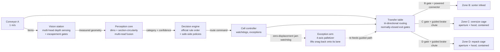

# SortMaster — Intelligent Robotic Product Sorting System

**Ozon Tech Hackathon — Track 3: «Интеллектуальная роботизированная система сортировки товаров»**

A software–hardware complex (ПАК), delivered **entirely in simulation**, that detects a product on the infeed conveyor, classifies it into one of three categories, and physically routes it to the correct processing zone — perception, decision and actuation working as one closed loop.

> **Status: validated closed loop + full scenario evidence base ✅** — the physics cell runs end to end on sensor data: items travel conveyor A at 1 m/s, classify **in motion** via the multi-head DWS sensor pipeline (route command ready **0.5+ s before table entry**, belt never stops), and the actuated transfer table routes them through normally-closed exit gates and guided brake chutes into aperture-walled roll cages. **Across the entire validation matrix — 22 runs, 235 items: nominal, borderline threshold attacks, close spacing, sensor noise, injected jams, failed transfers, 1.3× overload — ZERO unsafe errors, ZERO deadlocks, containment 1.0 everywhere.** Nominal runs: 100% routing at the reference seed (oracle: 100% on all seeds); on other seeds the official set's designed borderline items (detergent 0.73 ratio, helmet dome) occasionally rock into a **safe-side** divert — every logged error across every scenario is conservative, never an unsafe feed to the sorter. Jam → zero-displacement watchdog → arm recovery → guided re-delivery; escalation to operator call-out when out of reach or a cage fills. One command reproduces all of it: `python -m cell.validate`. This README is the root navigation document required by the submission rules ("Полнота комплекта сдачи решения", 0–5 pts). See [ROADMAP.md](ROADMAP.md) for the winning plan and [STEP_BY_STEP.md](STEP_BY_STEP.md) for the execution guide.

---

## 1. The task in one page

Items travel on a feed conveyor (**A**, fixed, belt speed **1 m/s**, belt never stops in the base scenario, max item size 500×500×500 mm) and accumulate in a buffer (накопитель) at its end. The complex must take each item from the accumulator and route it to:

| Zone | Category (official) | Meaning |
|---|---|---|
| **B** — main sorter infeed (fixed conveyor, 500 mm wide, h=700) | «Подходит для сортировки» | Fits the sorter: dims > 10×10×10 mm, fits 450×320×320 mm, **no circular cross-section** |
| **C** — oversize cage (roll-cage 1200×800×800, free placement) | «Не подходит для сортировки по габаритам» | Under- or over-size |
| **D** — repack cage (roll-cage 1200×800×800, free placement) | «Не подходит для сортировки без доупаковки» | Has a **circle in some cross-section** |

**Classification rules (priority order matters and is scored):**
1. **Dimensions gate first:** any dimension ≤ 10 mm (undersize) or exceeding 450×320×320 mm (oversize) → **C**. *An oversized cylinder goes to C, not D.*
2. **Then shape:** circle-in-cross-section, formally `r_inscribed / R_circumscribed ≥ 0.8` for a cross-section → **D**.
3. Otherwise → **B**.

Work zone: 6000×10000 mm; A and B positions fixed, C/D cages and everything else placed by us (see the official layout, [doc-1783009942.pdf](doc-1783009942.pdf)).

**A physical prototype is NOT required.** The rules explicitly accept an engineering solution proven by digital models, simulation and calculations — and the readiness matrix (УГТ) awards its maximum (Executive axis level 4) to a *validated simulation cross-checked against calculations*. That is exactly what we build.

> ✅ **Confirmed by the organizers' experts (Q&A, July 2026):** a physical prototype is not required for the final; the maximum level is "either a strong validated simulation / digital model, or a physical prototype". What matters is depth of engineering, realism, and how convincingly workability is proven. Our roadmap climbs exactly that ladder: working sim (min) → detailed engineering: layout, calculations, 3D models, fault handling (mid) → validated sim cross-checked against calculations (max).

## 2. Architecture (one closed loop, not two components)



Key design decisions (each is defended in the report):

- **Look-ahead classification.** The camera sits upstream: an item is classified *while still travelling* toward the accumulator, so inference latency (~tens of ms) is hidden and the arm receives its command *before* the item arrives — this addresses the scored "Синхронизация по времени" criterion directly.
- **Geometry-first perception (built, validated).** The official rules are purely geometric, so the pipeline measures geometry and implements the *formal* 0.8 criterion — not a black-box class label. The virtual sensor suite mirrors a standard DWS dimensioning tunnel: an overhead depth grid plus a light-section profile scanner with side heads (ray-cast — deterministic, zero OpenGL/GPU dependency, identical headless and in the jury's server). Analysis: min-area-rect dims + pose-robust minor axis from section radii; transverse slices along the item's main axis, densified at both ends; per-slice radial circularity + surface-of-revolution test; end-cap circles must be confirmed by several nearby slices. Multi-read fusion during belt transit follows the official decision order, and uncertain shapes divert to D — never to the sorter. **Validated: 100/99.1/99.1% categories over 330 randomized poses (3 seeds); closed-loop 8-seed campaign: 97.7% end-to-end, 100% executive, zero unsafe errors.** A learned detector (YOLO on synthetic renders) is a Phase-3+ add-on for tracking only; the category never comes from a network. This makes borderline behaviour explainable — worth points in three rubric lines.
- **Transfer table routes, the arm recovers.** The primary executive is a **tri-directional powered transfer table**: items are routed to B (north connector), C (east chute) or D (south chute) without ever being grasped — no universal-gripper assumption for arbitrary materials. The 4-axis palletizer arm stands at an **exception station**: a zero-displacement routing watchdog detects true jams (queue creep is flow, not a fault), the arm lifts the snagged item back onto its lane and the table re-delivers it through the normal guided path; unreachable snags escalate to operator call-out. The arm-primary design is preserved (`--executive arm`, tag `arm-primary-baseline`) and measured against the table in [docs/report/executive_mechanism_tradeoff.md](docs/report/executive_mechanism_tradeoff.md): both 100% executive-accurate and zero unsafe errors; the table needs **zero arm interventions** in nominal flow and has pipelining headroom.
- **Containment by design (перекладка без брака).** The item is guided and bounded at every hop, never thrown and never in free fall: funnel rails on belt A → edge rails + **normally-closed actuated lift gates** on the table (a route command is the only thing that opens a path off the table) → side-railed **single-slope chutes** (32°, μ < tan 32° — physically no stall points, even for recovery drops) with **brake pads** just above the cage floor → roll cages whose receiving wall carries a chute-sized **aperture with flanks, under-slope skirt and an anti-fly-out hood** (a cover parallel to the flow — no catch faces) plus a full-floor landing mat. Measured cage-entry speeds ≤ 2.1 m/s; every delivery is then tracked to the end of the run — the containment metric (below) proves items **stay** in the correct container.
- **The cell shows what it is doing (jury-readable executive).** Every station carries bilingual signage (EN/RU billboards + floor decals): A-infeed, vision station, active transfer table, B-sorter, C-oversize, D-repack, exception arm. Route state is live: the item is tinted with its perceived category the moment classification commits; zone-coloured lane markings, chevrons and chute flow-arrows pulse along the active route; destination beacons and gate lamps track the actual gate opening; an andon tower reads green/amber/red (idle / routing / jam-recovery); the escapement gate is a visible lifting flag. All presentation geoms are non-colliding, live in a sensor-invisible geom group (a depth camera does not image painted lines either), and are animated by [cell/visuals.py](cell/visuals.py) — physics and perception results are bit-identical with the layer on or off.
- **Safety by design.** Fenced cell, light curtain across the human access side, e-stop chain, reduced-speed service mode — modelled in the layout and described per the "Безопасность эксплуатации" criterion.

### 2.1 Containment validation — routed ≠ done

Reaching the right zone is necessary, not sufficient: the item must **stay inside the correct container**. Every C/D delivery is therefore tracked from the moment it crosses the cage aperture until the end of the run:

| Metric (per item → aggregated in `summary.json`) | Meaning | Gate |
|---|---|---|
| `contained` / `containment_rate` | never left the cage envelope (walls + hooded aperture zone) after delivery | **must be 1.0 — the run exits non-zero otherwise, same as a misroute** |
| `containment_violations` | count of escape events (`cell_event: containment_violation` with position) | 0 |
| `v_entry` / `cage_entry_speed_max_mps` | speed crossing into the cage — evidence of guided, non-thrown transfer | ≤ 2.2 m/s measured (≈ a 25 cm drop equivalent) |
| `cage_settle_s` | time from cage entry to rest (< 0.1 m/s for 0.5 s) | ~1–2 s measured |
| `cage_max_z` | highest point reached inside the cage — bounce headroom under the 0.8 m wall | ≤ 0.55 m measured |

Latest campaign (`scenarios/base.yaml`, all 11 official items per run): **6/6 oracle seeds and camera-perception runs at 100% routing + 100% containment, zero violations**; the fault drill (`fault_jam.yaml`) recovers an injected snag and still books 100% containment. Full numbers: [docs/report/containment_validation.md](docs/report/containment_validation.md).

### 2.2 Virtual sensor model (what `--perception camera` actually simulates)

The `camera` mode is a **virtual multi-head depth/dimensioning station** (DWS-tunnel class), not a hidden ground-truth feed. One visible config — `VIRTUAL_SENSOR` in [cell/params.py](cell/params.py) — holds every parameter, and each value is consumed by the implementation ([perception/pipeline.py](perception/pipeline.py)); a test suite ([tests/test_sensor_config.py](tests/test_sensor_config.py)) locks config↔implementation equality:

| Parameter | Value | Meaning |
|---|---|---|
| Sensing heads | **4 viewpoints** | overhead depth grid + light-section profilers: top fan + two side heads |
| Overhead head | (6.0, 3.0, 2.2) m | ray-cast depth grid, **3 mm** ground sampling |
| Profiler fans | 0.1° top / 0.2° side, planes every **4 mm** | swept along the belt (physically: one scanner + belt motion at 1 m/s) |
| Measurement window | x ∈ 5.85–6.28 m | items measured **in motion**; window ends before the escapement gate |
| Capture cadence | 0.12 s (~8 Hz) | multi-read evidence per item, fused per the official rule order |
| Depth noise | σ = 0 mm default, **scenario-tunable** | `sensor: {depth_noise_mm: 2.0}`; 0 = ideal-optics baseline |
| Processing latency | 80 ms | fusion verdict → route command (logged per item as `perception_latency_ms`) |

What the pipeline does with the returns: calibrated **background subtraction** (3σ empty-belt depth map) → morphological denoise → instance isolation with an **identity gate** (a measurement must cover the tracked item's position, else it is a sensor miss — a neighbor's cloud can never be committed under another item's identity) → min-area-rect dims (robust percentile extents under noise) → per-slice radial circularity + surface-of-revolution test → multi-read fusion with **guard bands**: a measurement within the sensor's uncertainty of the 10 mm / 450×320×320 mm limits or the 0.8 circle threshold **cannot take the permissive branch** — it diverts to the safe side (legal-metrology practice). A dimension below the certification floor (10 mm + 2× ground sampling) always diverts to C. Result: at σ = 2 mm the official set still routes **11/11 with zero unsafe errors**.

`camera` vs `oracle` is explicit everywhere: CLI banner, run folder name, `summary.json` (`perception_mode`, `sensor_model`, `oracle_used_for_classification: false` in camera mode) and `events.csv` per item. Oracle mode injects ground truth after a configured latency and exists only as a debugging/regression baseline.

**Why not more cameras? (multi-view trade study.)** The station already fuses 4 viewpoints, and every failure the scenario suite ever produced was a *flow/dynamics* problem, not a coverage problem: tailgaters merging into a cloud (fixed by slug-spaced accumulation + the identity gate), a thin item shoved *onto* a neighbor in a contact queue (fixed by no-contact queue lines), rocking items smearing their multi-read dims (temporal — any number of heads samples the same rocking pose). Extra heads would add ~33% ray cost each and force re-validation of the whole tuned stack while attacking none of the observed failure modes; the one genuinely resolution-limited case (9 mm pen barrel at 3 mm sampling) is neutralized by the certification floor, which routes "cannot certify > 10 mm" to C — exactly what the rules' priority demands. The documented upgrade path, if future evidence demands it: denser ground sampling (3→2 mm) first, a second along-belt overhead head second, 5-sided end-view heads last.

## 3. Ground truth for the official test set (computed, reproducible)

We analysed the 11 official STL models with the reference classifier ([tools/classify_mesh.py](tools/classify_mesh.py)). Dimensions are oriented-bounding-box extents; ratio is max over cross-sections along principal axes of `r_in/R_circ`:

| Item | OBB dims, mm | max r_in/R | Verdict | Why |
|---|---|---|---|---|
| Короб 300×200×200 (box) | 301×200×200 | 0.72 | **B** | fits, square section 0.72 < 0.8 |
| ЛанчБокс (lunchbox) | 201×152×62 | 0.66 | **B** | fits, rectangular |
| Моющее средство (detergent) | 280×260×179 | 0.73 | **B** | oval but below 0.8 — near-borderline |
| Короб 400×400×300 (box) | 401×400×300 | 0.72 | **C** | 400 > 320 → oversize |
| Пуфик (pouf) | 489×489×264 | ≈1.0 | **C** | circular **but oversize — priority rule** |
| Ручка (pen) | 148×13×**9** | ≈1.0 | **C** | 9 mm < 10 mm → undersize — priority rule |
| Бутылка (bottle) | 305×91×91 | 0.997 | **D** | circular section |
| Тарелка (plate) | 209×209×27 | 0.999 | **D** | circular |
| Шлем (helmet) | 352×298×282 | 0.89 | **D** | dome sections circular |
| Мешок (sack) | 202×176×170 | 0.886 | **D** | rounded blob (borderline; see note) |
| Цилиндр («cylinder») | 435×50×43 | **0.867** | **D** | actually a **hexagonal prism**: cos 30° = 0.866 ≥ 0.8, and 435 mm is just under the 450 limit — a designed double-borderline trap |

Machine-readable: [docs/ground_truth/item_ground_truth.json](docs/ground_truth/item_ground_truth.json).

**Documented interpretation choices** (flagged for organizer Q&A, analysed in the report's borderline-cases section):
- *Undersize* is triggered by **any** dimension < 10 mm (a 9 mm-thin pen falls through sorter gaps). Alternative reading (all dims < 10 mm) would flip the pen to D.
- The sack's ratio (0.886) is computed on the convex outer contour; physically a soft sack belongs in repack regardless — both readings agree on D.
- Sections are taken perpendicular to the item's principal axes (an arbitrary oblique cut through a cube can look hexagonal — clearly not the rule's intent).

## 4. Repository structure

```
.
├── README.md                    ← you are here (root navigation document)
├── ROADMAP.md                   ← phased winning plan mapped to the scoring rubric
├── STEP_BY_STEP.md              ← concrete execution guide (commands, order, gates)
├── docs/
│   ├── ground_truth/            ← computed expected categories for the official test set
│   ├── report/                  ← 🔜 final report (PDF)
│   └── presentation/            ← 🔜 defence deck (≤ 7 min)
├── tools/
│   ├── classify_mesh.py         ← reference classifier: STL/STEP → category (CLI)
│   └── make_borderline_items.py ← 5 designed threshold attacks (GT computed, not asserted)
├── cad/
│   ├── layout_v0.py             ← parametric cell layout (single source of truth for all dims)
│   └── out/                     ← generated: top-view PNG, 3D GLB scene, reach_check.json
├── cell/                        ← MuJoCo cell: scene gen, belts+gates, arm IK, controller, metrics
│   ├── run_sim.py               ← entrypoint (--perception camera|oracle, --viewer, --record MP4)
│   ├── validate.py              ← batch validation runner → validation_report.md (one command)
│   ├── visuals.py               ← live presentation state: route lights, lane pulse, andon tower
│   ├── signs.py                 ← bilingual EN/RU signage textures (rendered on demand)
│   └── assets/                  ← true-surface meshes (official + synthetic borderline) + manifests
├── configs/
│   └── validation_matrix.yaml   ← scenario × seed matrix with pass/fail expectations
├── flow/                        ← SimPy flow model: capacity, queues (physics-measured times)
├── scenarios/                   ← base, borderline, close_spacing, low_confidence,
│                                  fault_jam, failed_transfer, stress_mix
├── tests/                       ← rules + kinematics + containment invariants + sensor-config
│                                  truth + end-to-end smoke (pytest, 38 tests)
├── perception/                  ← ray-cast multi-head sensing + geometric classification
│   ├── pipeline.py              ← DWS sensor suite → dims, sections, category, confidence
│   ├── geometry.py              ← min-area rect, circle fit, envelope primitives
│   └── validate.py              ← randomized-pose campaign → docs/metrics/
├── extracted/                   ← official STL/STEP test-set models (from organizer archives)
├── requirements.txt             ← pinned dependencies
└── Dockerfile                   ← 🔜 one-command reproduction for the expert jury
```

Original organizer documents kept at repo root: task statement ([doc-1783095831.pdf](doc-1783095831.pdf)), scoring rubric ([doc-1783011400.pdf](doc-1783011400.pdf)), allowed software ([doc-1783009063.pdf](doc-1783009063.pdf)), layout scheme ([doc-1783009942.pdf](doc-1783009942.pdf)), STL/STEP archives.

## 5. Quickstart

```bash
# Python 3.12 venv (PyBullet has no Windows wheels; we use MuJoCo — wheels everywhere)
uv venv --python 3.12 .venv          # or: py -3.12 -m venv .venv
uv pip install --python .venv -r requirements.txt

# Classify any mesh — the reference implementation of the official rules
.venv/Scripts/python tools/classify_mesh.py "extracted/doc-1782987733/Stl/Бутылка.stl"
# → category D («Не подходит для сортировки без доупаковки»), r_in/R = 0.997

# Recompute the full ground-truth table
.venv/Scripts/python tools/classify_mesh.py --all "extracted/doc-1782987733/Stl" --json docs/ground_truth/item_ground_truth.json

# Prepare sim assets (official STLs + synthetic borderline items)
.venv/Scripts/python cell/prep_assets.py
.venv/Scripts/python tools/make_borderline_items.py

# Run the FULL CELL end to end (headless), sensing included
.venv/Scripts/python -m cell.run_sim --scenario scenarios/base.yaml --seed 42 --perception camera --executive table
# → runs/<stamp>_seed42_camera_table/events.csv + summary.json: classification /
#   executive / end-to-end accuracy, unsafe vs conservative errors, containment,
#   cycle_mean/p95/max, perception_latency_ms, command_margin_s, throughput,
#   arm interventions & recovery success
# --executive arm = the preserved arm-primary baseline;
# --perception oracle = ground-truth debug baseline; --viewer to watch live
.venv/Scripts/python -m cell.run_sim --scenario scenarios/base.yaml --seed 42 --perception camera --executive table --viewer

# ONE COMMAND, ALL EVIDENCE: every scenario x seed with pass/fail gates
.venv/Scripts/python -m cell.validate --matrix configs/validation_matrix.yaml
# → runs/validation_<stamp>/validation_report.md + validation_matrix.csv
#   (+ full events.csv/summary.json per run); exits non-zero on any failure
.venv/Scripts/python -m cell.validate --quick     # first seed of each entry

# Scenario suite (each also runs standalone):
#   base | borderline | close_spacing | low_confidence | fault_jam |
#   failed_transfer | stress_mix
.venv/Scripts/python -m cell.run_sim --scenario scenarios/fault_jam.yaml

# Record a demo MP4 of any run (cameras: overview | top_view | routing | lookahead)
.venv/Scripts/python -m cell.run_sim --scenario scenarios/base.yaml --record demo.mp4 --camera overview --fps 30

# Perception validation campaign: 11 items x N randomized poses, camera data only
.venv/Scripts/python -m perception.validate --poses 10 --seed 5
# → docs/metrics/perception_validation.{csv,json}; gate: >=95% categories

# Flow model: capacity & queueing from measured cycle times
.venv/Scripts/python -m flow.model    # → flow/out/sweep.csv + flow_sweep.png

# Test suite: rules + kinematics + containment invariants + sensor-config
# truth + end-to-end smoke (cycle metrics non-null, margins positive, fault
# drill produces a recovered intervention)
.venv/Scripts/python -m pytest tests -q
```

🔜 `docker compose up` — the exact environment the jury can run.

## 6. Toolchain (all from the organizers' allowed list)

| Purpose | Tool |
|---|---|
| Physics simulation of the cell | **MuJoCo 3** (primary — deterministic, scriptable, headless; ships wheels for Windows *and* Linux, so the dev and jury environments are identical. PyBullet was the original pick but publishes **no Windows wheels** — verified empirically; decision documented in the report). Isaac Sim optional for the demo video |
| Discrete-event flow & cycle time | **SimPy** (+ pandas, matplotlib for metrics) |
| Perception | **OpenCV**, **Open3D**, **Trimesh**, **Shapely**; **Ultralytics YOLO** for belt detection (synthetic training data rendered in **Blender**) |
| CAD / layout | **FreeCAD** (reads the official STEP models), exports STEP/STL |
| Packaging & reproducibility | **Python 3.11+**, **Docker**, **Git**; models exported to ONNX; scenes as URDF |
| Deliverable formats | PDF (report), MP4 (video), CSV/JSON (metrics), URDF/STL/STEP (models) |

## 7. Scoring map — where the 130 points live

| Rubric section | Max | Our vehicle |
|---|---|---|
| 1. Presentation | 10 | 7-min deck + rehearsed demo narrative |
| 2. Readiness matrix (УГТ 4×4) | 20 | CV L4 × Executive L4 = validated sim vs calculations |
| 3. Category correctness | 20 | Formal-rule classifier + borderline analysis + test-set demo |
| 4. Executive part & manipulation | 30 | Arm cell in physics sim: routing, grasping per shape, safety concept |
| 5. Performance & timing | 20 | Measured cycle_mean/p95/max + perception_latency_ms + command_margin_s per item; look-ahead sync (command ready 0.5+ s before table entry, belt never stops); fault/overload scenario suite |
| 6. Integration & realism | 15 | One message bus, category → command trace, industrially plausible cell |
| 7. Report, reproducibility, README | 15 | This README, Docker one-command run, full report |

## 8. For the expert jury (проверка решения)

- **Run instructions with pinned versions** — `requirements.txt` (Dockerfile 🔜).
- **One-command evidence:** `python -m cell.validate` runs every scenario × seed with explicit pass/fail gates and writes `validation_report.md`.
- **Tunable input parameters** (all per scenario YAML): item mix and spawn order (`items`, `seed`), arrival intensity (`spawn_gap_s`), sensor noise (`sensor: {depth_noise_mm: ...}`), classification policy (`classification: {min_confidence_for_B, low_confidence_route, ...}`), fault injection (`inject_jam: {slug, at_x}`), perception/executive mode (CLI `--perception camera|oracle --executive table|arm`).
- **Prepared scenarios:** nominal (`base`), borderline threshold attacks (`borderline`), close-spaced arrivals (`close_spacing`), degraded sensing (`low_confidence`), jam recovery (`fault_jam`), failed transfer (`failed_transfer`), 1.3× overload (`stress_mix`).
- **Cloud links** (large binaries: weights, full video, CAD sources) — collected here with descriptions when uploaded 🔜.

## 9. Team & contacts 🔜

| Role | Person |
|---|---|
| Lead / integration | — |
| Perception & ML | — |
| Simulation & mechanics | — |
| Report, video, presentation | — |

---

*Language note: working docs are in English; the submitted README/report/presentation will be delivered in Russian (the jury's language) — translation is a scheduled roadmap step, not an afterthought.*
