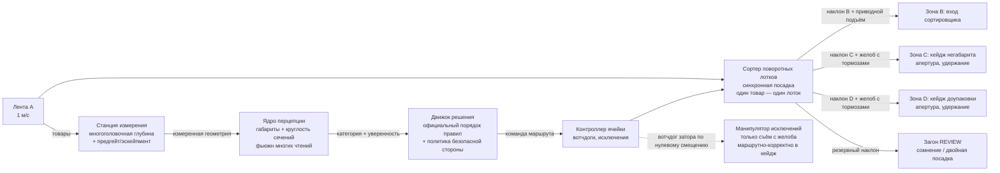

# SortMaster — интеллектуальная роботизированная система сортировки товаров

**Хакатон Ozon Tech — Трек 3: «Интеллектуальная роботизированная система сортировки товаров»** · команда **YOSOLO**

Программно-аппаратный комплекс (ПАК), выполненный **полностью в симуляции**: обнаруживает товар на подающем конвейере, относит его к одной из трёх категорий и физически доставляет в нужную зону обработки — перцепция, решение и исполнение работают одним замкнутым контуром.

> **Статус: ФИНАЛ — обе валидационные матрицы зелёные, все гейты PASS ✅.** Ячейка работает по замкнутому контуру на данных сенсоров в ОБОИХ движках. **Isaac Sim + RTX (матрица из 14 прогонов): GATES PASS** — номинальная классификация **1,0** (66/66 на 6 сидах), номинальная маршрутизация **1,0**, **ноль опасных ошибок маршрута и ноль падений на пол во всех 14 прогонах** (включая свипы трения/массы/интервала/смещения и обе аварийные дрели), удержание в таре **1,0**, минимальный запас команды **0,95 с**, ноль «скриптовых» перемещений груза (`direct_velocity_writes_nominal = 0` — жёсткий гейт). **MuJoCo-твин: 22/22 сценарных прогона, 235 товаров, ноль отказов** (72/72 модульных/конструкторских теста). Товары едут по ленте A со скоростью 1 м/с, классифицируются **в движении** на двухдиапазонной RTX-станции глубины (вердикт фиксируется **до эскейпмента**, лента не останавливается), синхронно выпускаются каждый на свой поворотный лоток и сходят гравитацией — C/D в ролл-кейджи с апертурными стенками по тормозным желобам 32°, B через приводной подъём на вход штатного сортировщика, сомнительный груз — в отдельный загон REVIEW. Сброс **не зависит от размера**: минимальный сертифицированный товар — **куб 11 мм**, измеренный макро-головкой ближнего диапазона как 11,0 мм (порог сертификации 10,8 мм) и физически доставленный в B; карта 2 мм, проскользнувшая под ножом эскейпмента (съём 3 мм), падает на защитный поддон и вызывает оператора — у каждого вида отказа есть спроектированный безопасный терминал, а код выхода прогона доказывает результат. Воспроизведение: `python -m cell.validate` (любая машина) / `bash isaac/run_matrix.sh` (GPU-сервер). Этот README — корневой навигационный документ комплекта сдачи. См. также [isaac/README.md](isaac/README.md), [docs/report/final_report_ru.md](docs/report/final_report_ru.md) (итоговый отчёт) и [docs/report/calculations_vs_simulation.md](docs/report/calculations_vs_simulation.md).

## 1. Задача на одной странице

Товары едут по подающему конвейеру (**A**, фиксированный, скорость ленты **1 м/с**, в базовом сценарии лента не останавливается, максимальный габарит товара 500×500×500 мм) и накапливаются в накопителе в его конце. Комплекс должен принимать каждый товар и направлять его:

| Зона | Категория (официально) | Смысл |
|---|---|---|
| **B** — вход основного сортировщика (фиксированный конвейер, ширина 500 мм, h = 700) | «Подходит для сортировки» | Проходит в сортировщик: габариты > 10×10×10 мм, укладывается в 450×320×320 мм, **нет круга в сечении** |
| **C** — кейдж негабарита (ролл-кейдж 1200×800×800, размещение свободное) | «Не подходит для сортировки по габаритам» | Меньше или больше допустимого размера |
| **D** — кейдж доупаковки (ролл-кейдж 1200×800×800, размещение свободное) | «Не подходит для сортировки без доупаковки» | Есть **круг в каком-либо сечении** |

**Правила классификации (порядок приоритета важен и оценивается):**
1. **Сначала габариты:** любой размер ≤ 10 мм (слишком мал) или выход за 450×320×320 мм (негабарит) → **C**. *Круглый негабаритный цилиндр идёт в C, а не в D.*
2. **Затем форма:** круг в сечении, формально `r_вписанной / R_описанной ≥ 0,8` для какого-либо сечения → **D**.
3. Иначе → **B**.

Рабочая зона: 6000×10000 мм; позиции A и B фиксированы, кейджи C/D и всё остальное размещаем мы (официальная схема: [doc-1783009942.pdf](doc-1783009942.pdf)).

**Физический прототип НЕ требуется.** Правила прямо допускают инженерное решение, доказанное цифровыми моделями, симуляцией и расчётами, — а матрица готовности (УГТ) присваивает максимум (уровень 4 исполнительной оси) именно *валидированной симуляции, сверенной с расчётами*. Ровно это мы и строим.

> ✅ **Подтверждено экспертами организаторов (Q&A, июль 2026):** физический прототип для финала не обязателен; максимальный уровень — «либо сильная валидированная симуляция / цифровая модель, либо физический прототип». Важна глубина инженерной проработки, реализм и убедительность доказательства работоспособности. Наш план идёт ровно по этой лестнице: работающая симуляция (минимум) → детальная инженерия: компоновка, расчёты, 3D-модели, обработка отказов (середина) → валидированная симуляция, сверенная с расчётами (максимум).

## 2. Архитектура (один замкнутый контур, а не два компонента)



Ключевые проектные решения (каждое защищается в отчёте):

- **Классификация с упреждением.** Камера стоит выше по потоку: товар классифицируется, *пока ещё едет* к накопителю, поэтому латентность распознавания (десятки мс) скрыта, и исполнение получает команду *до* прибытия товара — это прямой ответ на оцениваемый критерий «Синхронизация по времени».
- **Перцепция «геометрия прежде всего» (построена, провалидирована).** Официальные правила чисто геометрические, поэтому пайплайн меряет геометрию и реализует *формальный* критерий 0,8 — а не «чёрный ящик» с меткой класса. Виртуальный сенсорный комплект повторяет стандартный измерительный DWS-туннель: верхняя сетка глубины плюс профильный сканер светового сечения с боковыми головками (ray-cast — детерминированный, без OpenGL/GPU, одинаковый headless и на сервере жюри). Анализ: габариты по min-area-rect + устойчивая к позе малая ось по радиусам сечений; поперечные срезы вдоль главной оси с уплотнением на торцах; по-срезная радиальная круглость + тест поверхности вращения; торцевые круги должны подтверждаться несколькими соседними срезами. Фьюжн многих чтений за время проезда следует официальному порядку решения, а неоднозначная форма уходит в D — никогда в сортировщик. **Валидировано: 100/99,1/99,1 % категорий на 330 случайных позах (3 сида); замкнутый контур на 8 сидах: 97,7 % конец-в-конец, 100 % исполнение, ноль опасных ошибок.** Обученный детектор (YOLO на синтетических рендерах) — дополнение фазы 3+ только для трекинга; категория никогда не берётся из сети. Это делает пограничное поведение объяснимым — и приносит баллы сразу в трёх строках рубрики.
- **Маршрутизирует сортер поворотных лотков, манипулятор — восстанавливает.** Исполнительная часть — **линейный tilt-tray сортер** («поворотные лотки» — один из классов механизмов, названных в официальном брифе): после классификации эскейпмент выпускает каждый товар синхронно на подходящий ПУСТОЙ лоток (посадочное смещение меряется на каждом товаре), и привод наклона на шарнире сбрасывает его гравитацией на своей станции — C/D на юг в 32° тормозные желоба и ролл-кейджи, B на север через приводной подъём на вход штатного сортировщика, REVIEW на север в отдельный загон ручного разбора. Сброс **не зависит от размера** (куб 11 мм и пуф 489 мм едут и сходят одинаково) — инженерная причина, по которой этот механизм заменил роликовый/ARB-дек, неспособный сбрасывать товары меньше ~50–75 мм. Манипулятор исключений делает ровно одно: застревание на желобе (вотчдог + джем-камера) снимается маршрутно-корректно в свой же кейдж при заблокированной станции; застрявшему лотку манипулятор не нужен вовсе — его груз по конструкции доезжает до резерва REVIEW / вызова оператора в конце линии.
- **Удержание по конструкции (перекладка без брака).** Товар направляется и ограничен на каждом переходе, никогда не бросается и не бывает в свободном падении: боковые направляющие на ленте A → лотки с бортами и центральными торцевыми упорами (круглое самоцентрируется и не может скатиться; углы длинной коробки на сходе минуют торцы упора) → **глубокий сход** (желоб начинается на 50 мм ниже кромки наклонённого лотка, поэтому груз не может «замостить» лоток→желоб и заклинить) → **однонаклонные желоба** с бортами (32°, μ < tg 32° — физически нет точек остановки даже для аварийных сбросов) с **тормозными накладками** прямо над полом кейджа → ролл-кейджи, принимающая стенка которых несёт **апертуру под желоб с боковинами и козырьком** плюс посадочный мат на весь пол; спуск пересекает апертуру на z ≈ 0,22 м — низко и медленно. Измеренные скорости входа в кейдж ≈ 2 м/с; каждая доставка затем отслеживается до конца прогона — метрика удержания (ниже) доказывает, что товары **остаются** в правильной таре.
- **Ячейка показывает, что делает (читаемая жюри исполнительная часть).** На каждой станции двуязычные вывески (EN/RU щиты + напольная разметка): подача A, станция измерения, сортер, B-сортировщик, C-негабарит, D-доупаковка, ручной разбор, манипулятор исключений. Состояние маршрута — живое: товар подкрашивается своей категорией в момент фиксации вердикта; зонная разметка, шевроны и стрелки желобов пульсируют вдоль активного маршрута; маяки назначений и лампы станций ведут маршрут; андон-башня показывает зелёный/жёлтый/красный (простой / маршрутизация / разбор затора); эскейпмент — видимый выдвижной стопор. Вся презентационная геометрия неколлизионная, живёт в невидимой для сенсоров группе геомов (камера глубины не видит и нарисованные линии) и анимируется [cell/visuals.py](cell/visuals.py) — физика и результаты перцепции бит-в-бит совпадают со слоем и без него.
- **Безопасность по конструкции.** Огороженная ячейка, световая завеса на стороне доступа человека, цепь аварийного останова, сервисный режим пониженной скорости — смоделировано в компоновке и описано по критерию «Безопасность эксплуатации».

### 2.1 Валидация удержания — «доехал» ≠ «готово»

Достичь правильной зоны необходимо, но недостаточно: товар должен **остаться в правильной таре**. Поэтому каждая доставка C/D отслеживается от пересечения апертуры кейджа до конца прогона:

| Метрика (на товар → агрегат в `summary.json`) | Смысл | Гейт |
|---|---|---|
| `contained` / `containment_rate` | после доставки не покидал габарит кейджа (стенки + зона апертуры) | **обязана быть 1,0 — иначе прогон выходит с ненулевым кодом, как и при ошибке маршрута** |
| `containment_violations` | число событий «побега» (`cell_event: containment_violation` с позицией) | 0 |
| `v_entry` / `cage_entry_speed_max_mps` | скорость на входе в кейдж — доказательство направляемой, а не «брошенной» передачи | ≤ 2,2 м/с измерено (≈ эквивалент падения с 25 см) |
| `cage_settle_s` | время от входа в кейдж до покоя (< 0,1 м/с в течение 0,5 с) | ~1–2 с измерено |
| `cage_max_z` | максимальная точка внутри кейджа — запас по отскоку под стенкой 0,8 м | ≤ 0,55 м измерено |

Последняя кампания (`scenarios/base.yaml`, все 11 официальных товаров в каждом прогоне): **6/6 оракульных сидов и прогоны с камерной перцепцией на 100 % маршрутизации + 100 % удержания, ноль нарушений**; аварийная дрель (`fault_jam.yaml`) восстанавливает внесённое застревание и всё равно фиксирует 100 % удержания. Полные числа: [docs/report/containment_validation.md](docs/report/containment_validation.md).

### 2.2 Модель виртуального сенсора (что на самом деле симулирует `--perception camera`)

Режим `camera` — это **виртуальная многоголовочная станция глубины/обмера** (класс DWS-туннеля), а не скрытая подача ground truth. Один видимый конфиг — `VIRTUAL_SENSOR` в [cell/params.py](cell/params.py) — держит каждый параметр, и каждое значение потребляется реализацией ([perception/pipeline.py](perception/pipeline.py)); тест-набор ([tests/test_sensor_config.py](tests/test_sensor_config.py)) фиксирует равенство конфиг↔реализация:

| Параметр | Значение | Смысл |
|---|---|---|
| Измерительные головки | **4 точки обзора** | верхняя сетка глубины + профилографы светового сечения: верхний веер + две боковые головки |
| Верхняя головка | (5,55, 3,0, 2,2) м | ray-cast сетка глубины, разрешение по земле **3 мм** |
| Веера профилографов | 0,1° верх / 0,2° бок, плоскости каждые **4 мм** | развёртка вдоль ленты (физически: один сканер + движение ленты 1 м/с) |
| Окно измерения | x ∈ 5,65–6,05 м | товары меряются **в движении**; каждый вердикт фиксируется до эскейпмента |
| Каденция съёма | 0,12 с (~8 Гц) | многократные чтения на товар, фьюжн по официальному порядку правил |
| Шум глубины | σ = 0 мм по умолчанию, **настраивается сценарием** | `sensor: {depth_noise_mm: 2.0}`; 0 = базовая линия идеальной оптики |
| Латентность обработки | 80 мс | вердикт фьюжна → команда маршрута (логируется на товар как `perception_latency_ms`) |

Что пайплайн делает с данными: калиброванное **вычитание фона** (3σ-карта глубины пустой ленты) → морфологическая очистка → изоляция экземпляра с **гейтом идентичности** (измерение обязано накрывать позицию отслеживаемого товара, иначе это промах сенсора — облако соседа никогда не будет зачтено под чужой идентичностью) → габариты min-area-rect (устойчивые перцентильные экстенты под шумом) → по-срезная радиальная круглость + тест поверхности вращения → фьюжн многих чтений с **охранными полосами**: измерение в пределах неопределённости сенсора от порогов 10 мм / 450×320×320 мм / 0,8 **не может взять разрешающую ветку** — оно уходит на безопасную сторону (практика законодательной метрологии). Размер ниже пола сертификации (10 мм + 2× разрешение) всегда уходит в C. Результат: при σ = 2 мм официальный набор всё равно маршрутизируется **11/11 с нулём опасных ошибок**.

`camera` против `oracle` — явно всюду: баннер CLI, имя папки прогона, `summary.json` (`perception_mode`, `sensor_model`, `oracle_used_for_classification: false` в режиме camera) и `events.csv` по каждому товару. Режим oracle подставляет ground truth после заданной латентности и существует только как отладочная/регрессионная база.

**Почему не больше камер? (трейд-стади мульти-обзора.)** Станция уже сшивает 4 точки обзора, и каждый отказ, который когда-либо дала сценарная матрица, был проблемой *потока/динамики*, а не покрытия: «хвостовые» товары, сливающиеся в одно облако (закрыто слаг-интервалами накопления + гейтом идентичности), тонкий товар, задвинутый *на* соседа в контактной очереди (закрыто бесконтактными линиями очереди), качающиеся товары, размазывающие мультиread-габариты (временна́я проблема — любое число головок семплирует ту же качающуюся позу). Дополнительные головки добавили бы ~33 % стоимости лучей каждая и заставили бы перевалидировать весь настроенный стек, не атакуя ни один наблюдавшийся вид отказа; единственный действительно ограниченный разрешением случай (стержень ручки 9 мм при семплинге 3 мм) нейтрализован полом сертификации, который отправляет «не могу сертифицировать > 10 мм» в C — ровно как требует приоритет правил. Задокументированный путь апгрейда, если будущие данные потребуют: плотнее семплинг (3→2 мм) сначала, вторая верхняя головка вдоль ленты — потом, торцевые головки 5-стороннего обзора — в последнюю очередь.

## 3. Ground truth для официального тест-набора (вычислен, воспроизводим)

Мы проанализировали 11 официальных STL-моделей референсным классификатором ([tools/classify_mesh.py](tools/classify_mesh.py)). Габариты — экстенты ориентированного bounding box; отношение — максимум по сечениям вдоль главных осей `r_in/R_circ`:

| Товар | Габариты OBB, мм | max r_in/R | Вердикт | Почему |
|---|---|---|---|---|
| Короб 300×200×200 | 301×200×200 | 0,72 | **B** | помещается, квадратное сечение 0,72 < 0,8 |
| ЛанчБокс | 201×152×62 | 0,66 | **B** | помещается, прямоугольный |
| Моющее средство | 280×260×179 | 0,73 | **B** | овал, но ниже 0,8 — близко к границе |
| Короб 400×400×300 | 401×400×300 | 0,72 | **C** | 400 > 320 → негабарит |
| Пуфик | 489×489×264 | ≈1,0 | **C** | круглый, **но негабарит — правило приоритета** |
| Ручка | 148×13×**9** | ≈1,0 | **C** | 9 мм < 10 мм → мал — правило приоритета |
| Бутылка | 305×91×91 | 0,997 | **D** | круглое сечение |
| Тарелка | 209×209×27 | 0,999 | **D** | круглая |
| Шлем | 352×298×282 | 0,89 | **D** | купольные сечения круглые |
| Мешок | 202×176×170 | 0,886 | **D** | скруглённый «блоб» (граница; см. примечание) |
| Цилиндр («cylinder») | 435×50×43 | **0,867** | **D** | на самом деле **шестигранная призма**: cos 30° = 0,866 ≥ 0,8, а 435 мм — чуть меньше лимита 450: спроектированная двойная граница-ловушка |

Машиночитаемо: [docs/ground_truth/item_ground_truth.json](docs/ground_truth/item_ground_truth.json).

**Задокументированные выборы трактовки** (помечены для Q&A организаторов, разобраны в разделе пограничных случаев отчёта):
- *Undersize* срабатывает от **любого** размера < 10 мм (ручка толщиной 9 мм проваливается в щели сортировщика). Альтернативное чтение (все размеры < 10 мм) перевело бы ручку в D.
- Отношение мешка (0,886) посчитано по выпуклому внешнему контуру; физически мягкий мешок в любом случае идёт в доупаковку — оба чтения дают D.
- Сечения берутся перпендикулярно главным осям товара (произвольный косой срез куба может выглядеть шестиугольным — очевидно не смысл правила).

## 4. Структура репозитория

```
.
├── README.md                    ← вы здесь (корневой навигационный документ, RU)
├── README_EN.md                 ← английская инженерная версия этого документа
├── ROADMAP.md                   ← пофазный план, привязанный к рубрике оценки
├── STEP_BY_STEP.md              ← конкретный порядок работ (команды, порядок, гейты)
├── docs/
│   ├── ground_truth/            ← вычисленные ожидаемые категории официального набора
│   ├── report/                  ← итоговый отчёт: final_report_ru.md +
│   │                              печатный комплект ГОСТ 7.32 (final_report_gost.docx/.pdf,
│   │                              генерируется tools/make_report_docx.py)
├── YOSOLO_stage1_pitch_ru_FINAL.pptx ← дек защиты (14 слайдов, официальный шаблон РОБОЗОН)
├── tools/
│   ├── classify_mesh.py         ← референсный классификатор: STL/STEP → категория (CLI)
│   ├── expert_check.py          ← проверка ЛЮБОГО стороннего STL: правила + физический контур
│   ├── make_borderline_items.py ← спроектированные атаки на пороги (GT вычислен, не постулирован)
│   ├── make_edge_items.py       ← крайний набор: кубы 11/10 мм, стержень 9 мм, карта 2 мм
│   ├── consolidate_isaac_matrix.py ← матрица → matrix_summary.json + гейты §8
│   ├── make_perception_panels.py / make_endcard.py ← визуальные материалы для жюри
│   └── fetch_evidence.sh        ← выгрузка видео/журналов с рендер-сервера
├── cad/
│   ├── layout_v0.py             ← параметрическая компоновка ячейки (единый источник размеров)
│   └── out/                     ← генерируется: план сверху PNG, 3D-сцена GLB, reach_check.json
├── cell/                        ← MuJoCo-твин: генерация сцены, ленты + сортер лотков, IK руки,
│   │                              контроллер, метрики (cell/sorter.py = исполнительная часть)
│   ├── run_sim.py               ← точка входа (--perception camera|oracle, --viewer, --record MP4)
│   ├── validate.py              ← пакетный валидатор → validation_report.md (одна команда)
│   ├── visuals.py               ← живая индикация: маршрутные огни, пульс разметки, андон
│   ├── signs.py                 ← двуязычные EN/RU вывески (рендер по требованию)
│   └── assets/                  ← точные меши (официальные + синтетические пограничные) + манифесты
├── configs/
│   └── validation_matrix.yaml   ← матрица сценарий × сид с ожиданиями pass/fail
├── isaac/                       ← цифровой твин Isaac Sim: USD-сцена из cell/params.py,
│                                  замкнутый контур PhysX, RTX-видео и кадры глубины (§5.1)
├── flow/                        ← потоковая модель SimPy: пропускная способность, очереди
├── scenarios/                   ← base, borderline, close_spacing, low_confidence,
│                                  fault_jam, failed_transfer, stress_mix
├── tests/                       ← правила + кинематика + инварианты удержания + истинность
│                                  сенсор-конфига + сквозной smoke (pytest, 72 теста)
├── perception/                  ← ray-cast многоголовочный обмер + геометрическая классификация
│   ├── pipeline.py              ← DWS-комплект → габариты, сечения, категория, уверенность
│   ├── geometry.py              ← min-area rect, вписанная окружность, примитивы огибающей
│   └── validate.py              ← кампания случайных поз → docs/metrics/
├── extracted/                   ← официальные STL/STEP модели тест-набора (из архивов организаторов)
├── requirements.txt             ← зафиксированные зависимости
└── Dockerfile + docker-compose.yml ← воспроизведение одной командой (CPU-твин, проверено)
```

Оригинальные документы организаторов лежат в корне репозитория: постановка задачи ([doc-1783095831.pdf](doc-1783095831.pdf)), рубрика оценки ([doc-1783011400.pdf](doc-1783011400.pdf)), допустимое ПО ([doc-1783009063.pdf](doc-1783009063.pdf)), схема зоны ([doc-1783009942.pdf](doc-1783009942.pdf)), архивы STL/STEP.

## 5. Быстрый старт

```bash
# venv на Python 3.12 (у PyBullet нет колёс под Windows; мы используем MuJoCo — колёса везде)
uv venv --python 3.12 .venv          # или: py -3.12 -m venv .venv
uv pip install --python .venv -r requirements.txt

# Классифицировать любой меш — референсная реализация официальных правил
.venv/Scripts/python tools/classify_mesh.py "extracted/doc-1782987733/Stl/Бутылка.stl"
# → категория D («Не подходит для сортировки без доупаковки»), r_in/R = 0.997

# Пересчитать полную таблицу ground truth
.venv/Scripts/python tools/classify_mesh.py --all "extracted/doc-1782987733/Stl" --json docs/ground_truth/item_ground_truth.json

# Подготовить ассеты симуляции (официальные STL + синтетические пограничные)
.venv/Scripts/python cell/prep_assets.py
.venv/Scripts/python tools/make_borderline_items.py

# Прогнать ПОЛНУЮ ЯЧЕЙКУ конец-в-конец (headless), с сенсорикой
.venv/Scripts/python -m cell.run_sim --scenario scenarios/base.yaml --seed 42 --perception camera --executive table
# → runs/<штамп>_seed42_camera_table/events.csv + summary.json: точность
#   классификации / исполнения / конец-в-конец, опасные и консервативные ошибки,
#   удержание, cycle_mean/p95/max, perception_latency_ms, command_margin_s,
#   производительность, вмешательства руки и успех восстановления
# --executive arm = сохранённая базовая линия с рукой;
# --perception oracle = отладочная база на ground truth; --viewer — смотреть вживую
.venv/Scripts/python -m cell.run_sim --scenario scenarios/base.yaml --seed 42 --perception camera --executive table --viewer

# ОДНА КОМАНДА — ВСЕ ДОКАЗАТЕЛЬСТВА: каждый сценарий × сид с гейтами pass/fail
.venv/Scripts/python -m cell.validate --matrix configs/validation_matrix.yaml
# → runs/validation_<штамп>/validation_report.md + validation_matrix.csv
#   (+ полные events.csv/summary.json на прогон); ненулевой выход при любом провале
.venv/Scripts/python -m cell.validate --quick     # первый сид каждой строки

# Сценарный набор (каждый запускается и отдельно):
#   base | borderline | close_spacing | low_confidence | fault_jam |
#   failed_transfer | stress_mix
.venv/Scripts/python -m cell.run_sim --scenario scenarios/fault_jam.yaml

# Записать демо-MP4 любого прогона (камеры: overview | top_view | routing | lookahead)
.venv/Scripts/python -m cell.run_sim --scenario scenarios/base.yaml --record demo.mp4 --camera overview --fps 30

# Кампания валидации перцепции: официальные + пограничные товары × N случайных
# поз, только камерные данные. Гейты: точность на официальном наборе ≥95 %
# (сейчас 1,0) И ноль разрешающих ошибок — ничто из исключённого правилами
# не может быть увидено как «в сортировщик». Пограничные bl_* лежат в 0,02
# от порога, их консервативные вердикты репортятся, но не считаются промахами.
.venv/Scripts/python -m perception.validate --poses 10 --seed 5
# → docs/metrics/perception_validation.{csv,json}

# Устойчивость на незнакомых формах: 30 процедурных тел, которых ячейка не видела,
# против официальных правил, вычисленных из меша (вопрос «приватного набора»,
# отвеченный числами — включая два найденных разрешающих класса)
.venv/Scripts/python tools/unknown_shape_campaign.py --n 30 --poses 2 --seed 11
# → docs/report/unknown_shape_campaign.{md,json}

# Потоковая модель: пропускная способность и очереди из измеренных тактов
.venv/Scripts/python -m flow.model    # → flow/out/sweep.csv + flow_sweep.png

# Тесты: правила + кинематика + инварианты удержания + истинность сенсор-конфига
# + сквозной smoke (метрики цикла не пустые, запасы положительные, аварийная
# дрель даёт восстановленное вмешательство)
.venv/Scripts/python -m pytest tests -q
```

`docker compose up` — собирает CPU-образ твина и запускает полную матрицу из
22 прогонов с жёсткими гейтами (ненулевой выход при любом провале);
`docker compose run demo` пишет MP4 номинального прогона в `./out/`. Проверено
конец-в-конец на Docker Desktop (сборка + прогон в контейнере).

### 5.1 Цифровой твин Isaac Sim (`isaac/`) — та же ячейка, настоящие сенсоры, настоящие приводы

Полный замкнутый контур также работает в **NVIDIA Isaac Sim 6.0.1** (физика
PhysX 5, рендер RTX) — порт из того же единого источника истины
(`cell/params.py`), который идёт на шаг *дальше* MuJoCo-твина по реализму
сенсоров и приводов:

- **Классификация идёт с настоящего рендеренного сенсора — двухдиапазонного.**
  RTX-станция глубины (верхняя метрологическая головка + две боковые
  профильные + МАКРО-головка ближнего диапазона для мелкого груза) меряет
  каждый товар **в движении**; фьюжн многих чтений с гейтом полноты кадра
  и охранными полосами законодательной метрологии применяет официальный
  порядок правил. Охранная полоса масштабируется с головкой (пол сертификации
  «мал» = 10 мм + 2×GSD → 16 мм верхняя, **10,8 мм макро**): **куб 11 мм
  честно сертифицируется как сортируемый и физически доставляется в B**,
  а куб 10 мм и ручка 9 мм консервативно остаются в C.
- **Исполнение — контактная физика с настоящими приводами.** Конвейеры несут
  товары поверхностной скоростью PhysX (механизм Isaac Conveyor-Belt-utility)
  на проектных скоростях (лента A на официальной 1,0 м/с — проверено пробой).
  **Поезд поворотных лотков** несёт каждый товар на своём динамическом лотке
  (шарнир + угловой позиционный привод, конвейер команды 40 мс, рампа 160°/с,
  шум усиления, насыщение по моменту); сход триггерится по позиции с энкодера
  цепи и подтверждается фактическим уходом товара; каждая команда логируется,
  и `summary.json` сертифицирует `direct_velocity_writes_nominal: 0`.
  Дисциплина потока — физические выдвижные стопоры; посадка — синхронный
  выпуск через нож-кромку с измерением посадочного смещения на каждом товаре.
  Товары несут физику класса материала (картон/ПЭТ/HDPE/ABS/мягкий мешок:
  трение, реституция, демпфирование), свипованную ×0,7/×1,3 в валидации.
- **Отказы обрабатываются по камерным данным.** Камера глубины зоны желобов
  локализует застрявший товар вычитанием фона; манипулятор исключений берёт
  по фиксу камеры (уточнённому одометрией) и кладёт **маршрутно-корректно
  в его же кейдж** при заблокированной станции; мёртвому приводу наклона рука
  не нужна — его груз по конструкции едет в резерв REVIEW / вызов оператора
  в конце линии (`--inject-tray-fault` это доказывает).

```bash
# на GPU-сервере, внутри официального контейнера isaac-sim:6.0.1
/isaac-sim/python.sh isaac/run_isaac.py --seed 42 --record --camera overview \
    --out /tmp/sortmaster_out/final_seed42
# → summary.json + events.csv (тот же словарь метрик, что и в MuJoCo),
#   frames/*.png -> MP4, кадры vision_rgb/depth, события jam_located
```

Междвижковое согласие по физической огибающей (ноль опасных ошибок,
удержание 1,0, скорость входа в кейдж и высота отскока внутри измеренных
MuJoCo границ, запас команды ≥ 0,5 с) — это ровно планка УГТ «валидированная
симуляция, сверенная с расчётами», а твин Isaac добавляет доказательство
«сенсор в контуре». Доказательства: [docs/report/isaac_evidence/](docs/report/isaac_evidence/);
детали пакета: [isaac/README.md](isaac/README.md).

## 6. Инструментарий (всё из допустимого перечня организаторов)

| Назначение | Инструмент |
|---|---|
| Физическая симуляция ячейки | **Два движка, одна ячейка** (оба из допустимого перечня). **MuJoCo 3** — детерминированный валидационный движок (матрица 22/22 сценариев, headless, одинаково на любой машине жюри). **NVIDIA Isaac Sim 6.0.1 (PhysX 5 + RTX)** — высокоточный цифровой твин ТОЙ ЖЕ ячейки, собранный из того же единого источника `cell/params.py` и запускаемый на GPU-сервере команды (RTX 5090); междвижковое согласие физической огибающей — само по себе валидационное доказательство (см. §5.1). Изначально был выбран PyBullet, но он **не публикует колёса под Windows** — проверено эмпирически; решение задокументировано в отчёте |
| Дискретно-событийный поток и такт | **SimPy** (+ pandas, matplotlib для метрик) |
| Перцепция | **OpenCV**, **Open3D**, **Trimesh**, **Shapely**; **Ultralytics YOLO** для детекции на ленте (синтетические данные — рендер в **Blender**) |
| CAD / компоновка | **FreeCAD** (читает официальные STEP-модели), экспорт STEP/STL |
| Упаковка и воспроизводимость | **Python 3.11+**, **Docker**, **Git**; модели — в ONNX; сцены — в URDF |
| Форматы сдачи | PDF (отчёт), MP4 (видео), CSV/JSON (метрики), URDF/STL/STEP (модели) |

## 7. Карта баллов — где живут 130 баллов

| Раздел рубрики | Макс | Наш инструмент |
|---|---|---|
| 1. Презентация | 10 | Дек на 7 минут + отрепетированный демо-нарратив |
| 2. Матрица готовности (УГТ 4×4) | 20 | CV L4 × Исполнение L4 = валидированная симуляция против расчётов |
| 3. Корректность категорий | 20 | Классификатор по формальным правилам + анализ границ + демо на тест-наборе |
| 4. Исполнительная часть и манипуляции | 30 | Tilt-tray сортер в настоящей физике: полный цикл (сигнал → наклон → сход → лоток снова горизонтален), сброс независим от размера вкл. куб 11 мм, поведение по формам свиповано, концепция безопасности |
| 5. Производительность и тайминги | 20 | Измеренные cycle_mean/p95/max + perception_latency_ms + command_margin_s на товар; упреждающая синхронизация (вердикт зафиксирован до эскейпмента; **мин. запас команды 0,95 с** по всей матрице; лента не останавливается); набор сценариев отказов/перегруза |
| 6. Связность и реализм | 15 | Одна шина сообщений, трасса «категория → команда», индустриально правдоподобная ячейка |
| 7. Отчёт, воспроизводимость, README | 15 | Этот README, запуск одной командой в Docker, полный отчёт |

## 8. Экспертам жюри (проверка решения)

> **Быстрый старт.** Всё решение проверяется двумя командами.
> MuJoCo-твин (любая машина, CPU): `python -m cell.validate` — полная матрица
> 22 прогонов с гейтами, отчёт в `runs/validation_*/validation_report.md`.
> Isaac-твин (GPU, официальный контейнер `isaac-sim:6.0.1`):
> `bash isaac/run_matrix.sh /out/m && python3 tools/consolidate_isaac_matrix.py /out/m`
> — 14 прогонов + консолидация с жёсткими гейтами (ненулевой выход при любом
> провале). Одиночный прогон с видео и кадрами сенсоров:
> `/isaac-sim/python.sh isaac/run_isaac.py --seed 42 --record --depth-stills 3`.
> Итоговый отчёт: [docs/report/final_report_ru.md](docs/report/final_report_ru.md).

- **Инструкции запуска с зафиксированными версиями** — `requirements.txt`; Isaac работает в официальном контейнере `nvcr.io/nvidia/isaac-sim:6.0.1` (точный набор монтирований — в [isaac/README.md](isaac/README.md)).
- **Доказательства одной командой:** `python -m cell.validate` (MuJoCo, 22 прогона × гейты) и `bash isaac/run_matrix.sh <out>` + `tools/consolidate_isaac_matrix.py <out>` (Isaac, 14 прогонов + жёсткие гейты). Обе выходят с ненулевым кодом при любом провале.
- **Настраиваемые входные параметры — MuJoCo** (YAML сценария или CLI): состав и порядок подачи товаров (`items`, `--seed`), интенсивность подачи (`spawn_gap_s`), шум сенсора (`sensor: {depth_noise_mm}`), политика классификации (`classification: {...}`), внесение отказов (`inject_jam: {slug, at_x}`), режим перцепции (`--perception camera|oracle`).
- **Настраиваемые входные параметры — Isaac** (CLI `isaac/run_isaac.py`): `--seed`, `--items <подмножество>`, `--manifest-extra` (добавляет крайний набор вкл. кубы 11/10 мм, стержень Ø9 мм, карту 2 мм), `--spawn-gap A,B`, `--spawn-offset-y`, `--friction-mult`, `--mass-mult`, `--inject-jam SLUG@Y` (застревание на желобе → восстановление рукой), `--inject-tray-fault ZONE` (мёртвый привод наклона → вызов в конце линии), `--perception rtx|oracle`, `--record --camera ... --fps`, `--depth-stills N` (кадры RGB/глубины/макро «глазами сенсора»).
- **Готовые сценарии:** номинал (`base`), пограничные атаки на пороги (`borderline`), плотная подача (`close_spacing`), деградированная сенсорика (`low_confidence`), восстановление из затора (`fault_jam`), сорванная передача (`failed_transfer`), перегруз 1,3× (`stress_mix`); матрица Isaac дополнительно свипует трение ×0,7, массу ×1,3, плотную подачу, смещённую подачу и обе аварийные дрели.
- **Свой STL (требование экспертов / приватный набор):** любой сторонний тестовый STL можно
  прогнать через официальные правила и через ФИЗИЧЕСКИЙ контур:
  `python tools/expert_check.py path/to/model.stl` — класс + полная трасса
  решения (габариты OBB, r/R по сечениям, категория, причина);
  `python tools/expert_check.py model.stl --register --mass 0.4` — регистрирует
  товар для симуляторов и печатает готовые команды запуска (CPU-твин без GPU
  или Isaac с RTX-перцепцией). Правила меряют геометрию, а не запоминают
  выданный набор, поэтому решение по построению переносится на новые товары.
  Сводка прогона показывает, как ЖИВАЯ перцепция измерила товар, какой класс
  назначила и куда физически доставила.
- **Резерв без GPU:** если тестовый стенд отличается от нашей среды, полный
  контур проверяется БЕЗ GPU цифровым двойником MuJoCo
  (`python -m cell.validate`, детерминированный, 22 прогона × гейты), а
  RTX-результаты приложены как видео + матричные артефакты
  ([docs/report/isaac_evidence/](docs/report/isaac_evidence/)).
- **Инженерный пакет:** [архитектура ПАК](docs/report/architecture.md) ·
  [схема компоновки](docs/report/figures/layout_plan.png) (генерируется из
  `cell/params.py`) · [кинематика каретки](docs/report/figures/carrier_kinematics.png) ·
  [спецификация узлов](docs/report/node_spec.md) ·
  [before/after доказательства механики](docs/report/isaac_evidence/xbelt/proof_pack/README.md).
- **Доказательства перцепции (панели для жюри):** панели «RGB + RTX-глубина +
  сегментация + сшитые габариты + решение маршрута», собранные из настоящих
  кадров сенсора скриптом `tools/make_perception_panels.py` —
  [panels](docs/report/isaac_evidence/xbelt/perception/panels/) ·
  [пограничные панели](docs/report/isaac_evidence/xbelt/perception/panels_edge/)
  (куб 11 мм→B против куба 10 мм→C на полу сертификации 10,8 мм) ·
  [perception_demo.mp4](docs/report/isaac_evidence/xbelt/perception/perception_demo.mp4) ·
  финальная [карточка метрик](docs/report/isaac_evidence/xbelt/videos_final/endcard.png).
  Наложенные маски сегментации и облака точек — СОБСТВЕННЫЙ экспорт
  измерительного пайплайна (`RTXPerception.export_masks` → `vision_mask_*.png`,
  `vision_cloud_*.npy`, вкл. макро-головку ближнего диапазона), пиксельно
  совмещённый с сохранёнными кадрами — не пересчёт на стороне визуализации.
- **Где лежат бинарные материалы.** Всё, что нужно для оценки решения, —
  **в этом репозитории**, скачивать ничего не нужно: матрица Isaac из 14
  прогонов с сырыми артефактами по каждому, матрица твина из 22 прогонов
  ([docs/report/validation/](docs/report/validation/)), машинные аудиты,
  кадры сенсоров + экспортированные маски/облака и набор видео
  ([docs/report/isaac_evidence/](docs/report/isaac_evidence/), ~520 МБ).
  Правила сдачи допускают вынос крупных бинарников в облако со ссылками —
  мы вместо этого держим их в репозитории, чтобы доказательства были
  версионированы вместе с кодом, который их произвёл: один `git clone` даёт
  эксперту полный автономный комплект без внешних зависимостей.

## 9. Команда YOSOLO

| Участник | Роль | Вклад |
|---|---|---|
| **Рикардо Замбрано (Ricardo Zambrano)** | Инженер-мехатроник | Механика ячейки и исполнительная часть tilt-tray; оба физических твина (Isaac Sim + MuJoCo) из единого источника `cell/params.py`; интеграция перцепции с исполнением |
| **Ульяна Назаренко (Uliana Nazarenko)** | Аналитик данных | Валидационные матрицы и гейты; конвейер метрик (такт, запас команды, precision/recall по категориям); курирование доказательств — запечатанные журналы, панели, набор видео |

Команда из двух человек довела до сдачи оба движка, запечатанную матрицу
Isaac из 15 прогонов, CPU-твин из 22 прогонов и инструмент проверки на
собственных STL — всё в этом репозитории воспроизводится жюри без обращения
к команде.

---

*Примечание о языках: комплект сдачи — README, отчёт, презентация — на русском
(язык жюри). Английская инженерная версия этого документа сохранена как
[README_EN.md](README_EN.md); рабочие документы разработки (ROADMAP,
STEP_BY_STEP) остаются на английском.*
